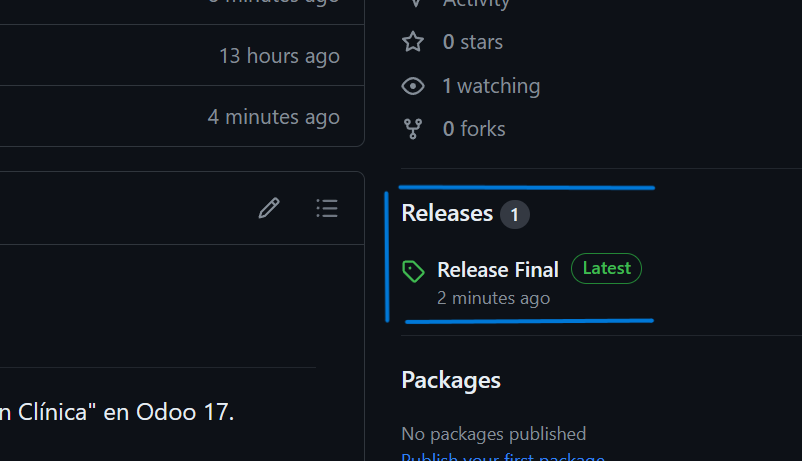
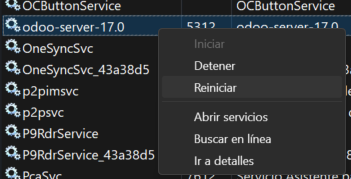
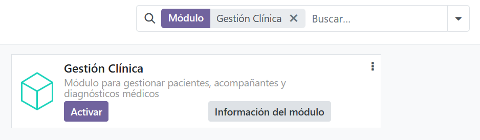
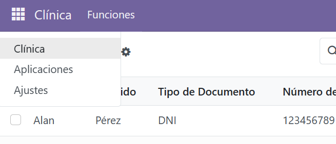

# Instalación del Módulo de Odoo

Este README proporciona los pasos necesarios para instalar el módulo "Gestión Clínica" en Odoo 17.

## Requisitos Previos

- Se requiere tener instalado Odoo en su sistema. Puede descargarlo desde [el sitio web oficial de Odoo](https://www.odoo.com/es_ES/).

## Pasos de Instalación

1. **Descarga del Módulo:**
   - Descargue el archivo comprimido `Modulo.zip` desde las releases del repositorio.

        

2. **Extracción del Archivo:**
   - Extraiga el contenido del archivo descargado.

3. **Ubicación del Módulo:**
   - Copie el directorio del módulo (carpeta llamada `gestion_clinica`) en el directorio de los módulos de Odoo. La ubicación predeterminada puede variar según la instalación de Odoo. Si usaste la instalación predeterminada se encuentra en `c:\program files\odoo 17.0.20240222\server\odoo\addons`.

4. **Reinicie el Servidor de Odoo:**
   - Reinicie el servidor de Odoo para que reconozca el nuevo módulo. Puede hacerlo desde el administrador de tareas en el apartado `Servicios`

        

5. **Acceso al Panel de Administración de Odoo:**
   - Acceda al panel de administración de Odoo utilizando su navegador web. Por lo general, puede acceder ingresando la URL `localhost:8069` en su navegador.

6. **Inicio de Sesión como Administrador:**
   - Inicie sesión en Odoo con las credenciales de administrador.

7. **Activación del Módulo:**
   - Vaya al menú de configuración y seleccione la opción "Aplicaciones".
   - En la barra de búsqueda, escriba el nombre del módulo ("Gestión Clínica") y presione Enter. (Verifica que hayas puesto los tildes en la búsqueda)
   - Busque el módulo en la lista y haga clic en el botón "Instalar" o "Activar" para activarlo.

        

8. **Uso del Módulo:**
   - Una vez instalado y activado, podrá acceder a las funciones y características del módulo desde el panel de administración de Odoo.

        

## Datos de Prueba

Este módulo incluye datos de prueba preconfigurados para ayudarlo a familiarizarse con sus características y funcionalidades rápidamente.

